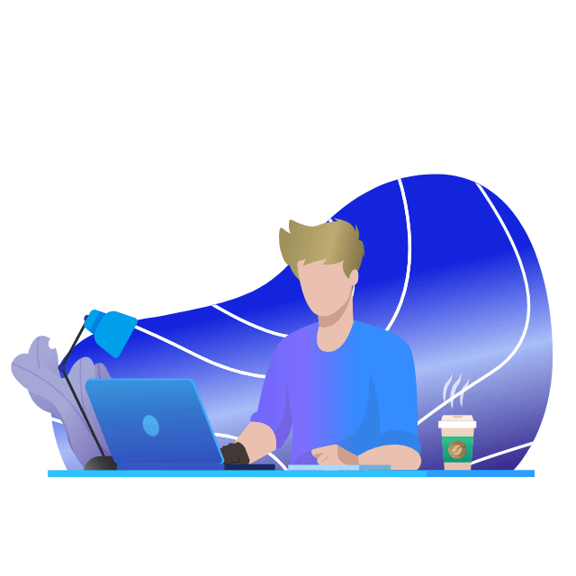
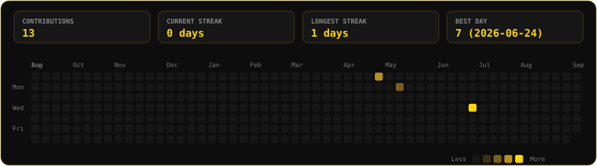

<!-- Venom Animated Hero Header -->

 

<!-- Profile Badges -->

 

<!-- Typing SVG Banner -->

---

### <code>The Cipher Stack & Visual Matrix</code>

<table border="0" cellspacing="10" cellpadding="0" align="center" width="100%">
  <tr>
    <td align="center" valign="top" width="50%">
      
    </td>
    <td align="center" valign="top" width="50%">
      
    </td>
  </tr>
  <tr>
    <td align="center" valign="top" width="50%">
      
    </td>
    <td align="center" valign="top" width="50%">
      
    </td>
  </tr>
</table>

---

### <code>Live Contribution Matrix</code>

  

---

### <code>Featured Projects</code>

<table border="0" cellspacing="10" cellpadding="10" width="100%">
  <tr>
    <td width="50%" valign="top" style="background:#0d0d0d; border:1px solid rgba(212,175,55,0.3); border-radius:8px;">
      <h4><a href="https://topupchai.shop" target="_blank">⚡ 01. Topup Web</a></h4>
      
<i>Full automated AI system Games Topup Web</i>

      
A high-performance gaming top-up automation platform powered by smart payment parsing and real-time game API integration.

      

        
      

    </td>
    <td width="50%" valign="top" style="background:#0d0d0d; border:1px solid rgba(212,175,55,0.3); border-radius:8px;">
      <h4><a href="https://like.gamingsymoon.shop" target="_blank">🔥 02. Auto Like Web</a></h4>
      
<i>Fully automated Free Fire Like selling site</i>

      
Seamless web interface and high-speed automated service for game profile boosts and instant order processing.

      

        
      

    </td>
  </tr>
  <tr>
    <td width="50%" valign="top" style="background:#0d0d0d; border:1px solid rgba(212,175,55,0.3); border-radius:8px;">
      <h4><a href="https://github.com/DEV-MITUL/Free-Fire-Auto-Topup" target="_blank">🎯 03. FF Auto Topup</a></h4>
      
<i>Automation engine for FF in-game topup</i>

      
Headless browser automation script utilizing Python and custom session handlers for direct in-game currency topup.

      

        
      

    </td>
    <td width="50%" valign="top" style="background:#0d0d0d; border:1px solid rgba(212,175,55,0.3); border-radius:8px;">
      <h4><a href="https://github.com/DEV-MITUL/BGMI-AUTO-TOPUP" target="_blank">🎮 04. BGMI Auto Topup</a></h4>
      
<i>Automation for BGMI topup using Unipin</i>

      
Automated voucher redemption and API gateway solver for UniPin BGMI topup operations.

      

        
      

    </td>
  </tr>
</table>

---

### <code>Tech Arsenal</code>

#### 🌐 Frontend & 3D Graphics

#### ⚡ Backend & Databases

#### 📱 Mobile Development

#### 🛠️ Tools & DevOps

---

### <code>System Log // What I'm Up To</code>

| Category | Details |
| :--- | :--- |
| 🔭 **Currently Building** | Next-gen AI game automation web services & real-time topup engines |
| 🧠 **Currently Learning** | Advanced WebGPU 3D rendering & Distributed Microservice Architectures |
| ⚡ **Fun Fact** | I turn repetitive manual web tasks into 1-click autonomous Python bots |
| 💬 **Ask Me About** | React, Web Automation, Node.js API Design, Game Topup Gateways |

---

### <code>GitHub Achievements</code>

  
  
  
  

---

### <code>Socials & Connection</code>

  

<!-- Dynamic Portfolio QR Code -->
<table>
  <tr>
    <td align="center" style="background:#0d0d0d; padding:15px; border:1px solid rgba(212,175,55,0.4); border-radius:12px;">
       
      <code style="color:#D4AF37;">SCAN TO VISIT PORTFOLIO</code>
    </td>
  </tr>
</table>

 

<!-- Footer Waving Banner -->

